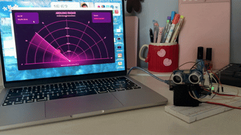
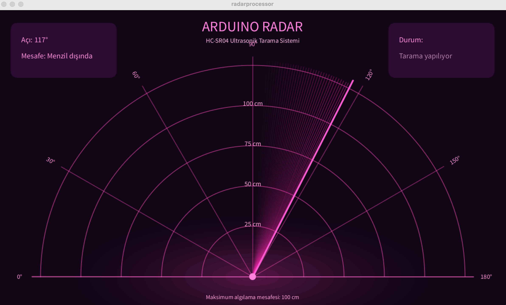

# Arduino Radar System with Distance Alert

## Overview

<p align="center">
</p>

A real-time radar system developed using **Arduino Uno**, an **HC-SR04 ultrasonic sensor**, an **SG90 servo motor**, a **passive buzzer**, and **Processing**.

The system scans its surroundings by rotating the ultrasonic sensor, measures the distance of detected objects, and visualizes the results through a custom radar interface.

A passive buzzer provides audio feedback when objects are detected within a certain distance range.

This project combines **embedded hardware**, **sensor integration**, **serial communication**, and **real-time data visualization** to create an interactive radar system.

---

## Radar Interface

<p align="center">
  
</p>

The Processing interface displays:

- Real-time radar sweep
- Detected object position
- Object distance
- Servo angle information
- Visual proximity feedback

---

## Features

- 📡 Real-time radar scanning
- 📏 Distance measurement using HC-SR04 ultrasonic sensor
- 🔄 Continuous servo sweep from **15° to 165°**
- 💗 Custom Processing radar visualization
- 🎯 Real-time object detection and tracking
- 🔔 Passive buzzer proximity alerts
- ⚡ Serial communication between Arduino and Processing

---

## Hardware

| Component | Arduino Pin |
|-----------|-------------|
| HC-SR04 Trig | D3 |
| HC-SR04 Echo | D2 |
| SG90 Servo Signal | D9 |
| Passive Buzzer | D8 |
| VCC | 5V |
| GND | GND |

### Components Used

- Arduino Uno
- HC-SR04 Ultrasonic Sensor
- SG90 Servo Motor
- Passive Buzzer
- Breadboard
- Jumper Wires

---

## Software

- Arduino IDE
- Processing 4

---

## How It Works

1. The Arduino controls the servo motor and rotates the ultrasonic sensor between **15° and 165°**.
2. The HC-SR04 ultrasonic sensor measures the distance of objects at each angle.
3. Arduino sends angle and distance data to Processing through serial communication.
4. Processing receives the data and renders a real-time radar interface.
5. The passive buzzer changes its tone based on the detected distance.

---

## Distance Alert System

| Distance | Buzzer Behaviour |
|----------|------------------|
| 0–10 cm | High-frequency tone |
| 11–20 cm | Medium-frequency tone |
| 21–30 cm | Low-frequency tone |
| Above 30 cm | Silent |

---

## Serial Communication Format

Arduino sends data to Processing using:

```
angle,distance.
```

Example:

```
45,38.
46,37.
47,36.
```

Where:

- `angle` represents the servo position
- `distance` represents the measured distance in centimeters

---

## Project Structure

```
Arduino-Radar/
│
├── assets/
│   ├── radargif.gif
│   └── radarinterface.png
│
├── radar.ino
├── radarprocessor.pde
└── README.md
```

---

## Getting Started

### Arduino Setup

1. Connect the components according to the wiring table.
2. Open `radar.ino` using Arduino IDE.
3. Upload the sketch to Arduino Uno.

### Processing Setup

1. Open `radarprocessor.pde` using Processing 4.
2. Close the Arduino Serial Monitor before running Processing.
3. Run the Processing sketch.
4. The radar interface will display live sensor data.

---

## Future Improvements

- OLED display integration
- RGB LED distance indicator
- Portable battery-powered version
- ESP32 wireless monitoring
- Adjustable detection thresholds
- Data logging and analysis
- Multiple scanning modes

---

## Author

Developed by **Dilan Tok** as a personal project exploring **embedded systems, sensor integration, and real-time visualization**.
